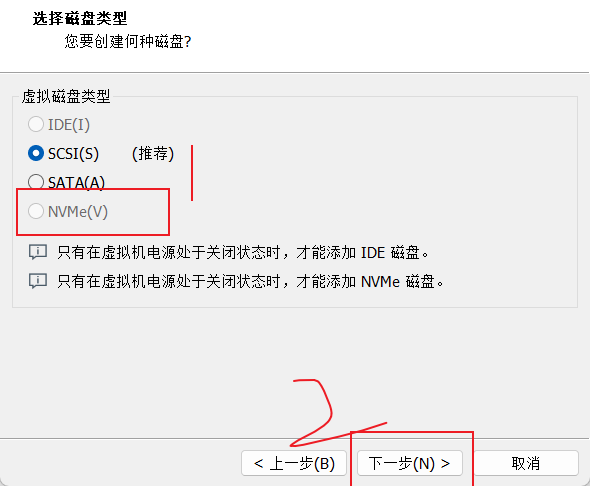

# 操作前需知

- <mark>所有的测试都必须先运行前面那个模块 </mark>
  

# 终端快捷方式

- 粘贴（上）下一条命令

  > 方向键上下键
  >
- 翻查历史记录

  > CTRL+R
  >
- 终止当下命令

  > CTRL+C
  >
- 退出终端

  > eixt/quit/CTRL+E
  >
- 清理屏幕

  > clear
  >
- 查看之前打过的命令（可关键词查找）

  > history
  >
- 将光标移到行首

  > CTRL+A
  >
- 将光标移到行尾

  > CTRL+E
  >
- 将光标按单词往前移

  > ALT+B
  >
- 将光标按单词往后移

  > ALT+F
  >
- 向前删除一个单词

  > ALT+BACESPACE
  >
- 向后删除一个单词

  > ALT+D
  >

# Linux一些命令操作

- 列出所有可更新的软件清单命令

  > sudo apt update
  >
- 升级软件包

  > sudo apt upgrade
  >
- 查看当前路径下的文件

  > ll
  >
- 显示指定工作目录下之内容

  > ls
  >
- 改变终端所在路径

  > cd <mark>路径</mark>
  >
- 打开文件

  > sudo gedit <mark>文件路径</mark> **.** <mark>文件名</mark>//*按TAB键显示当下文件夹*
  >
- 查看当前在哪个路径

  > pwd
  >
- <mark>如无法将本机复制粘贴到虚拟机解决方法</mark>

  > sudo apt install open-vm-tools
  >
- 删除包

  > sudo apt remove <mark>文件名</mark>
  >
- 删除冗余包

  > sudo apt autoremove
  >
- 查找某文件路径

  > which <mark>文件名</mark>
  >
- 查看用户的关键信息

  > cat /etc/passwd
  >
- 下载包

  > sudo apt install <mark>文件名</mark>
  >
- 帮助手册

  > man <mark>命令</mark>
  >
- 命令用于连接文件并打印到标准输出设备上

  > cat /etc/passwd
  >
- 抄代码 *//搬砖*

  > git clone
  >
- 将硬盘列出来

  > lsblk
  >

# ssh测试

## 步骤

---

1. 更新系统

   > sudo apt update
   >
2. 下载ssh包

   > sudo apt install openssh-server
   >
3. 查IP地址

   > ip a
   >

## 补充

- 服务

  > systemctl
  >
- 查看ssh服务

  > systemctl status sshd
  >
- 重启ssh服务

  > systemctl restart sshd
  >
- 开启ssh服务

  > systemctl start sshd
  >
- 关闭ssh服务

  > systemctl stop sshd
  >
- 检查是否安装成功ssh服务

  > ssh <mark>用户名 </mark> @localhost
  >

---

# 换源测试

## 步骤

---

1. 打开换源的文件

   > sudo gedit /etc/apt/sources.list
   >
2. 替换国内源<mark>*//这里仅展示中科大源*</mark>

   > deb https://mirrors.ustc.edu.cn/ubuntu/ jammy main restricted universe multiverse
   > deb-src https://mirrors.ustc.edu.cn/ubuntu/ jammy main restricted universe multiverse
   > deb https://mirrors.ustc.edu.cn/ubuntu/ jammy-updates main restricted universe multiverse
   > deb-src https://mirrors.ustc.edu.cn/ubuntu/ jammy-updates main restricted universe multiverse
   > deb https://mirrors.ustc.edu.cn/ubuntu/ jammy-backports main restricted universe multiverse
   > deb-src https://mirrors.ustc.edu.cn/ubuntu/ jammy-backports main restricted universe multiverse
   > deb https://mirrors.ustc.edu.cn/ubuntu/ jammy-security main restricted universe multiverse
   > deb-src https://mirrors.ustc.edu.cn/ubuntu/ jammy-security main restricted universe multiverse
   > deb https://mirrors.ustc.edu.cn/ubuntu/ jammy-proposed main restricted universe multiverse
   > deb-src https://mirrors.ustc.edu.cn/ubuntu/ jammy-proposed main restricted universe multiverse
   >
3. 更新系统

   > sudo apt update
   >
4. 更新软件

   > sudo apt upgrade
   >

## 考试如果禁用剪切板的话，补救方式
1. >wget http://web.tecxz.com:7080/ubuntu/sources.list.ustc
2. >sudo mv sources.list.ustc /etc/apt/sources.list
3. 更新系统

   > sudo apt update
   >
4. 更新软件

   > sudo apt upgrade
   >

---

# 基础测试

1. 下载git和zsh

   > sudo apt install git zsh
   >
2. 下载curl
   > sudo apt install curl
   >
3. 调用老师的zsh

   > curl -fsSL http://web.tecxz.com:7080/file/zsh/install.sh | sh
   >
4. 默认改成zsh

   > chsh -s /usr/bin/zsh
   >
5. 改zsh主题（第11行双引号里的改成ys）

   > gedit ~/.zshrc
   

## 补充

- <mark>改成zsh后必须要登**pyclss**，不然命令运行不了</mark>

---

# 分区创建测试

1. 创建新硬盘（15个G）

   1. 
   2. 
   3. 
   4. 
   5. 
   6. <mark>一路确定下去</mark>
   7. 
2. 查找是否有新硬盘

   > ls /dev
   >

   
3. 进入硬盘设置

   > 进入nvme0n1分区
   >

   1. 

   > 显示当前磁盘的分区表
   >

   2. 

   > 增加一个新的分区
   >

   3. <mark>输入n后按回车 </mark>
   4. 
   5. 
   6. 
   7. 
   8. 
   9. <mark>分区1命名 </mark>
   
      
   10. <mark>分区2命名 </mark>
   
        
   11. 
   12. 
   13. <mark>检查是否硬盘分区成功 </mark>

---

# 磁盘挂载测试(<mark>挂载必须先挂载p2，再挂载p1</mark>)

1. 创建B系统的目录

   > sudo mkdir /mnt/usb
   >
2. 对p1盘格式化
   
3. 对p2盘格式化
   
4. 挂载p2盘

> sudo mount /dev/nvme0n1p2 /mnt/usb

5. 创建/mnt/usb/boot/efi目录

> sudo mkdir -p /mnt/usb/boot/efi

6. 挂载p1盘

> sudo mount /dev/nvme0n1p1 /mnt/usb/boot/efi

7. 查看是否挂载成功

> lsblk

# B系统预创建测试

1. B系统根目录
   > ls /mnt/usb
   >
2. 构建一套基本的系统(根文件系统)
   - sudo apt install debootstrap
   - sudo apt search arch-install
   - sudo apt install arch-install-scripts
3. 查看源的网站地址
   > cat /etc/apt/sources.list
   > 
   >
4. 下载根文件系统
   > sudo debootstrap --arch=amd64 jammy /mnt/usb https://mirrors.ustc.edu.cn/ubuntu/
   >
5. 创建fstab
   > genfstab /mnt/usb | sudo tee /mnt/usb/etc/fstab
   >
6. 检查一下
   > cat /mnt/usb/etc/fstab
   >
7. 复制A系统sources.list文件至B系统nt/usb/etc/apt 目录下
   > sudo cp /etc/apt/sources.list /mnt/usb/etc/apt/sources.list
   >

# B系统安装基础测试

1. 检查一下
   > cat /mnt/usb/etc/apt/sources.list
   >
2. 将A系统的dev目录与B系统的dev目录绑定

   > sudo mount -o bind /dev /mnt/usb/dev

3. 验证是否绑定成功
   > ls /mnt/usb/dev
   >
4. 将系统信息绑定
   > sudo mount -o bind /sys /mnt/usb/sys
   >
5. 将用户信息绑定
   > sudo mount -o bind /proc /mnt/usb/proc
   >
6. 转换到B系统
   > sudo chroot /mnt/usb
   >
7. 在A系统修改启动项自动挂载P2盘（<mark>不能自动挂载P1盘</mark>）
   1. sudo gedit /etc/fstab
   2. /dev/nvme0n1p2	/mnt/usb	ext4	errors=remount-ro 0       1
  
      
## 字符界面使用文本编辑器

  - nano编辑器
    >nano   //q启动编辑器  
    >CTRL+X     //保存
    >sudo nano <mark>文件的绝对路径</mark>
  - vim编译器 //<mark>重要</mark>
    - 下载vim编译器
    >sudo apt install vim
  - vi编译器
    - 插入(ESC退出)
      >按I
    - 进入命令界面
      >按冒号
    - 保存并退出
      >wq
    - 退出
      >q

  
---
# B系统必备软件测试

1. 在B系统更新软件
   >apt update
2. 在B系统安装Linux的内核

- 在A系统拷贝 sources.list到B系统上
  > sudo cp /etc/apt/sources.list /mnt/usb/etc/apt/sources.list
  >
- 转换到B系统更新系统
  > sudo apt update
  >
- 下载Linux内核到B系统
  > apt install linux-image-generic
  >
3. 设置root密码
    >passwd

    
4. 创建一个用户
    >useradd joker -m
5. 验证是否用户有home目录
    >ls /home
6. 给刚创建的用户越权权限
    >usermod -aG sudo <mark>用户名</mark>
7. 安装网络工具软件
    >apt install net-tools network-manager
8. 安装nano编译器
   >sudo apt install nano
---
# B系统引导测试

1. 安装grub
    >apt install efibootmgr grub-efi-amd64
2. 更新系统
    >apt update
3. 挂载
    >mount -t efivarfs efivarfs /sys/firmware/efi/efivars/
4. 下载grub
    >grub-install -v --target=x86_64-efi --recheck /dev/nvme0n1
5. 使用nano编辑器编译
    >nano /etc/default/grub
    
    

6. 更新grub
    >update-grub
7. 下载NetworkManager
    >apt install network-manager

# B系统ssh测试(关机后进入A系统才能跑100分，在字符界面安装)

1. 重启进入B系统
2. 输入账户密码
3. 使用bash
   >bash
4. 使用指令查看
   >systemctl status NetworkManager

    
5. 输入（可用TAB补全）
   >sudo nano /usr/lib/NetworkManager/conf.d/10-globally-managed-devices.conf
6. 注释掉内容
   
7. 输入
   >sudo systemctl restart NetworkManager
8. 查看ip
   >ip a
9. 更新
    >sudo apt update
10. 安装ssh
    >sudo apt install openssh-server
11. 查看ip
    >ip a

# B系统基础测试（关机后进入A系统才能得100分，在字符界面安装）

1. 安装zsh和git
   >sudo apt install zsh git
2. 安装zsh环境
   >wget http://web.tecxz.com:7080/file/zsh/install.sh
3. 运行zsh
   >sh install.sh

   
## 系统的进入方法（开机时狂点ESC键）
- 第一个B系统， 第二个A系统 
    
- SCSI的为A系统， NUME的为B系统
    
## B系统安装图形化界面（考试不考）

1. 下载安装图形化界面的app
  > sudo apt install tasksel
2. 进入tasksel
  > tasksel
3. 选择第二个
4. 下载失败
  > sudo apt update
  > sudo apt upgrade 
---

# 搜狗输入法安装

1. 去搜狗官网下载linux版x86版本的输入法
2. 切换至downloads目录下
    >切换至downloads目录下
3. 安装输入法
    >sudo dpkg -i sogoupinyin_4.0.1.2800_x86_64.deb
4. 提示缺失一些安装包,给它补上
    >sudo apt install -f
5. 再次执行安装命令
    >sudo dpkg -i sogoupinyin_4.0.1.2800_x86_64.deb
6. 卸载原有输入法
    >sudo apt remove --purge ibus
7. 安装俩个依赖包
    >sudo apt install libqt5qml5 libqt5quick5 libqt5quickwidgets5 qml-module-qtquick2
    >sudo apt install libgsettings-qt1
8. 重启虚拟机
   >登入界面右下角改一下
---

# Samba测试

1. 下载Samba
    >sudo apt install Samba
2. 检测是否下载成功
    >systemctl status smbd.service 

    
3. 创建Samba账号，用户名为share
    >sudo useradd share
4. 将系统普通账号添加到samba 用户中
    >sudo smbpasswd -a share
5. 在根目录下创建data
    >sudo mkdir /data
6. 更改权限
    >sudo chown share:share /data
7. 打开编辑器
    >sudo gedit /etc/samba/smb.conf
8. 将里面所有内容更改为http://web.tecxz.com:7080/file/smb.conf
    >[smb_share]
comment=This is the share foler of user share
path=/data 
writable=yes 
valid users=share 
public=no

  <mark>如果禁用剪辑版,</mark>
  - wget http://web.tecxz.com:7080/file/smb.conf
  - sudo mv smb.conf /etc/samba/smb.conf

    
9. 重启文件
    >sudo systemctl restart smbd.service
10. 
11. 输入Samba用户名密码， 随便放入一个文件
12. linux终端中输入ll /data， 检测是否放入成功
# WPS下载

1. 先去官网下载WPS安装包，安装WPS
    >sudo dpkg -i <mark>WPS安装包名</mark>
2. 安装完后右下角有WPS软件图标，鼠标右键允许运行
3. 虚拟机浏览器中搜索http://web.tecxz.com:7080/ubuntu/，下载wps-fonts.zip文件
4. 解压wps-fonts.zip文件
    >unzip wps-fonts.zip
5. 移动文件
    >sudo mv wps-fonts-master/wps/* /usr/share/fonts/wps-office/
6. 更新
    >fc-cache -fv
7. 再次打开WPS文档，成功则不会显示字体缺失
---
# xrdp测试
1. 下载srdp(远程桌面协议)
    >sudo apt install xrdp
2. 启动xrdp
    >sudo systemctl restart xrdp
3. 查看启动状态
    >sudo systemctl status xrdp
4. 启动开机自启
    >sudo systemctl enable xrdp
5. 添加xrdp的用户组，赋予用户权限
    >sudo usermod -aG ssl-cert xrdp
6. 编辑startwm.sh文件
    >sudo gedit /etc/xrdp/startwm.sh

    >Unset DBUS_SESSION_ADDRESS

    > Unset XDG_RUNTIME_DIR 

    
7. 将共享文件权限改为所有人
    >sudo gedit /etc/X11/Xwrapper.config

      <mark>将allowed_users=anybody改为allowed_users=everybody</mark>
8. 重新启动虚拟机
   >sudo reboot
9. 完成后用windows的远程桌面去连接
    
10. 输入虚拟机ip
    
11. 