# 云计算竞赛训练平台
**竞赛训练平台网址**：[云计算竞赛平台](http://10.16.87.67:7070/ "竞赛训练")    
**云电脑网址**： [VMware® vSphere](https://10.16.86.111/ "竞赛用机")
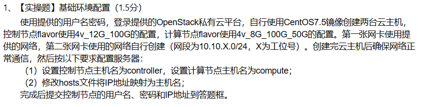

- （1）更改网卡名称  
    **此界面按Tab键**
 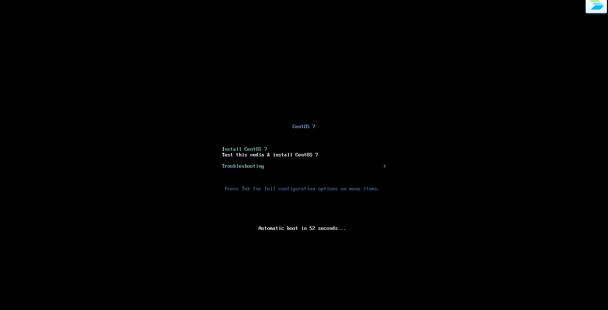
    > net.ifnames=0  biosdevname=0
- （2）网络配置
    > vi /etc/sysconfig/network-scripts/ifcfg-eth1
    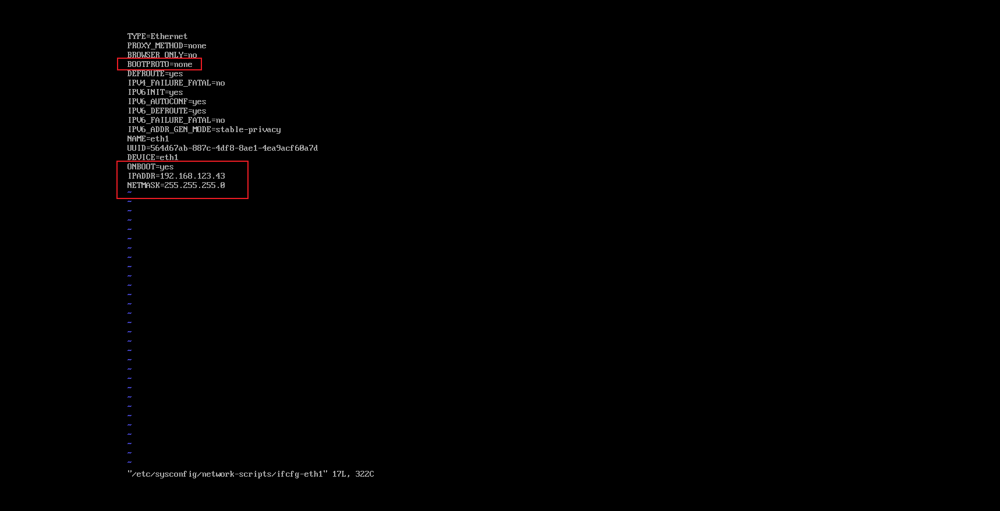
    - [x] **systemctl restart network**重启网络服务
    - [x] **ip a**查看是否有ip
    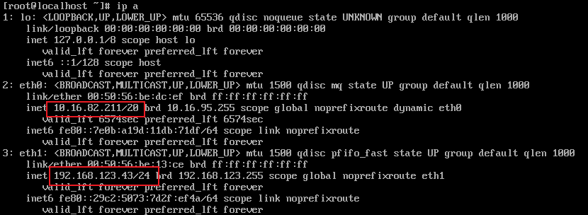
- （3）设置控制节点主机名为controller，设置计算节点主机名为compute
    > hostnamectl set-hostname <mark>主机名</mark>

    - [x] **hostnamectl**查看是否为更改的主机名
- （4）修改hosts文件将IP地址映射为主机名
    > vi /etc/hosts

    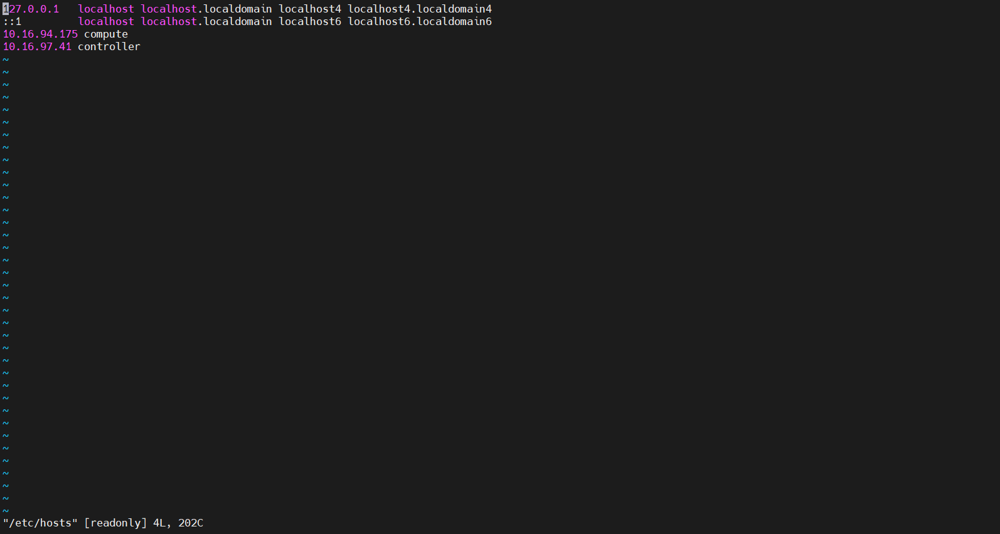  
    - [x] **ping controller**和**ping compute**可以ping得通
    - [x] moba ssh服务连接得上 
---
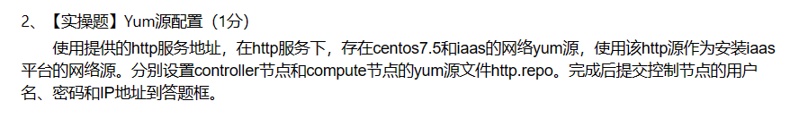

- （1）移除原有yum源文件
    > mv /etc/yum.repos.d/* /media/
- （2）新建一个yum源文件http.repo
    > vi /etc/yum.repos.d/http.repo
- （3）编辑文件填写以下内容
    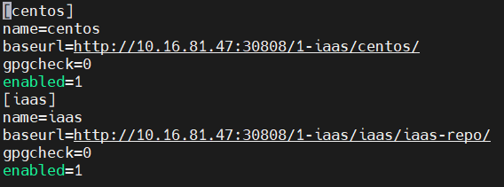
- （4）添加本地缓存
    > yum makecache  
    
    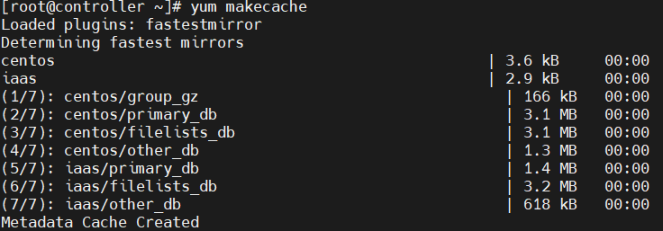
    - [x] **yum repolist**查看yum源是否配置成功
    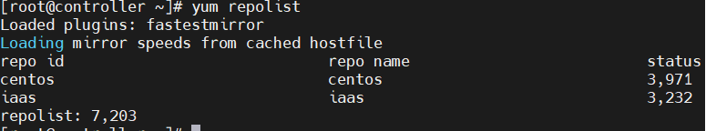
---
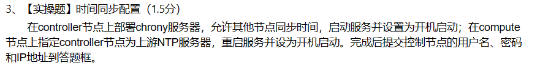
- （1）安装iaas-xiandian
    > yum install iaas-xiandian -y
- （2）配置xiandan文件
    > vi /etc/xiandian/openrc.sh
- （3）跑脚本iaas-pre-host.sh
    > iaas-pre-host.sh
    - [x] 跑脚本没有出错
---
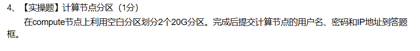

- （1）fdisk命令创建分区
  - [x] lsblk查看是否分区成功
---
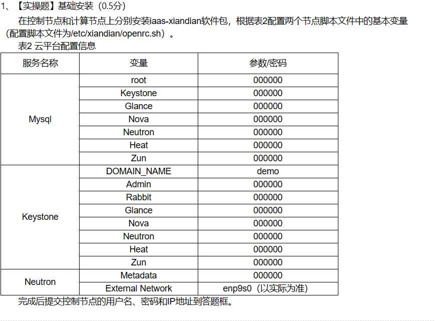
- [x] 直接跑分
---
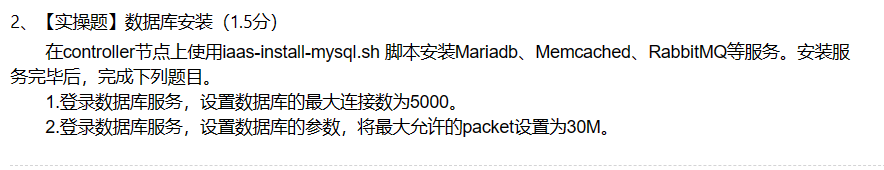
- （1）**controller**上跑脚本iaas-install-mysql.sh
    > iaas-install-mysql.sh
- （2）编辑数据库文件
    > vi /etc/my.cof

    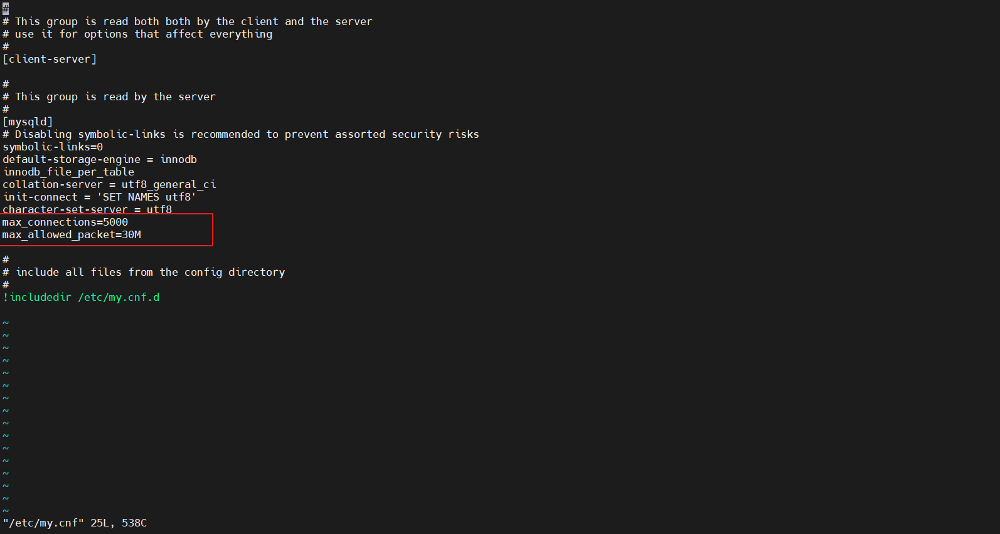
    - [x] systemctl restart mariadb重启数据库服务
---
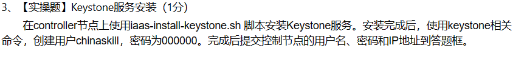
- （1）运行脚本
    > iaas-install-keystone.sh
- （2）
    > source /etc/keystone/admin-openrc.sh
- （3）创建openstack用户
    > openstack user create --domin demo --password 000000 chinaskill
    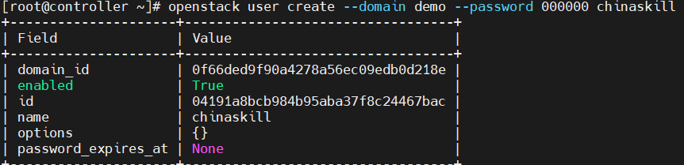
    - [x] openstack user list
    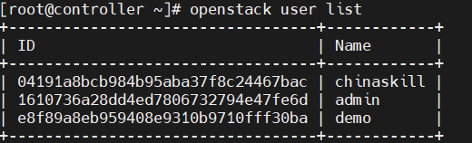
---
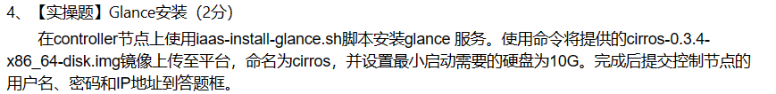

- （1）运行脚本
    > iaas-install-glance.sh
- （2）下载镜像
    > curl -O http://10.16.81.47:30808/1-iaas/cirros-0.3.4-x86_64-disk.img
- （3）命名为cirros，并设置最小启动需要的硬盘为10G
    > glance image-create --name "cirros" --disk format qcow2 --min-disk 10 --container-format bare --progress < ./cirros-0.3.4-x86_64-disk.img
    - [x] openstack image list
    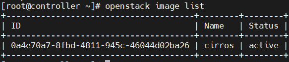
---
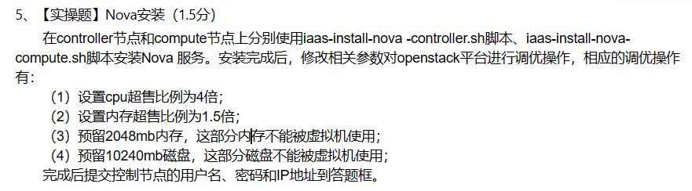

- （1）controller，compute分别运行脚本
    > iaas-install-nova-controller.sh
    > iaas-install-nova-compute.sh
- （2）配置nova文件
    > vi /etc/nova/nova.conf
  