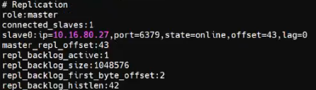

# 云计算竞赛训练平台
**竞赛训练平台网址**：[云计算竞赛平台](http://10.16.87.67:7070/ "竞赛训练")    
**云电脑网址**： [VMware® vSphere](https://10.16.86.111/ "竞赛用机")
* 疑难解答
1.  失去auth-url
    
    >source /etc/keystone/admin-openrc.sh
2. 
## 

- （1）更改网卡名称  
    **此界面按Tab键**
 
    > net.ifnames=0  biosdevname=0
- （2）网络配置
    > vi /etc/sysconfig/network-scripts/ifcfg-eth1
    
    - [x] **systemctl restart network**重启网络服务
    - [x] **ip a**查看是否有ip
    
- （3）设置控制节点主机名为controller，设置计算节点主机名为compute
    > hostnamectl set-hostname <mark>主机名</mark>

    - [x] **hostnamectl**查看是否为更改的主机名
- （4）修改hosts文件将IP地址映射为主机名
    > vi /etc/hosts

      
    - [x] **ping controller**和**ping compute**可以ping得通
    - [x] moba ssh服务连接得上 
---
## 

- （1）移除原有yum源文件
    > mv /etc/yum.repos.d/* /media/
- （2）新建一个yum源文件http.repo
    > vi /etc/yum.repos.d/http.repo
- （3）编辑文件填写以下内容
    
- （4）添加本地缓存
    > yum makecache  
    
    
    - [x] **yum repolist**查看yum源是否配置成功
    
---
## 
- （1）安装iaas-xiandian
    > yum install iaas-xiandian -y
- （2）配置xiandan文件
    > vi /etc/xiandian/openrc.sh
- （3）跑脚本iaas-pre-host.sh
    > iaas-pre-host.sh
    - [x] 跑脚本没有出错
---
## 

- （1）fdisk命令创建分区
  - [x] lsblk查看是否分区成功
---
## 
- [x] 直接跑分
---
## 
- （1）**controller**上跑脚本iaas-install-mysql.sh
    > iaas-install-mysql.sh
- （2）编辑数据库文件
    > vi /etc/my.cof

    
    - [x] systemctl restart mariadb重启数据库服务
---
## 
- （1）运行脚本
    > iaas-install-keystone.sh
- （2）
    > source /etc/keystone/admin-openrc.sh
- （3）创建openstack用户
    > openstack user create --domin demo --password 000000 chinaskill
    
    - [x] openstack user list
    
---
## 

- （1）运行脚本
    > iaas-install-glance.sh
- （2）下载镜像
    > curl -O http://10.16.81.47:30808/1-iaas/cirros-0.3.4-x86_64-disk.img
- （3）命名为cirros，并设置最小启动需要的硬盘为10G
    > glance image-create --name "cirros" --disk format qcow2 --min-disk 10 --container-format bare --progress < ./cirros-0.3.4-x86_64-disk.img
    - [x] openstack image list
    
---
## 

- （1）controller，compute分别运行脚本
    > iaas-install-nova-controller.sh  
    > iaas-install-nova-compute.sh
- （2）配置nova文件
    > vi /etc/nova/nova.conf

    cpu_allocation_ratio = 4.0  
    ram_allocation_ratio = 1.5  
    reserved_host_memory_mb = 2048  
    reserved_host_disk_mb = 10240  
---
## 

- （1）运行脚本
    > iaas-install-neutron-controller.sh    
    > iaas-install-neutron-compute.sh
---
## 

-  （1）运行脚本
    > iaas-install-dashboad.sh
    - [x] 浏览器**controller节点ip**+/dashboard
    
    用户名：admin  
    密码：000000
---
## 

- （1）运行脚本
    > iaas-install-swift-controller.sh  
    > iaas-install-swift-compute.sh
- （2）返回空则为验证swift启动成功
    > openstack container list
- （3）创建一个名叫examcontainer的容器
    > swift post examcontainer
- （4）输出表格内有examcontainer则成功
    > openstack container list
---
## 

- （1）运行脚本
    > iaas-install-cinder-controller.sh    
    > iaas-install-cinder-compute.sh
- （2）使用cinder命令创建一个名字叫blockvolume，大小为2G的云硬盘
    > cinder create --name blockvolume 2
- （3）该命令用于检查是否创建成功
    > cinder list
---
## 

- （1）运行脚本
    > iaas-install-heat.sh
---
## 
- （1）在/root目录下编写Heat模板heat-image.yaml
    > vi heat-image.yaml
- （2）编写模板内容通过使用swift外部存储方式创建镜像heat-image
    
    
- （3）创建模板
    > openstack stack create -t heat-image.yaml heat-image
---

**此题应环境问题做不出分**
- （1）控制节点执行
  > echo none > /sys/block/vda/queue/scheduler  
  > cat /sys/block/vda/queue/scheduler

  [none] mq-deadline kyber      #前面为“[none]”为正确

---
## 

- （1）所有节点执行
    > yum install nfs-utils rpcbind
- （2）NFS节点执行（可用controller节点代替）
    1. 新增目录并编辑/etc/exports新增以下内容  
        > mkdir -p /mnt/test  
        > vi /etc/exports  

        以下为/etc/exports里的内容  
        /mnt/test 10.16.0.0/16(rw,sync,no_root_squash)
    2. 修改权限并重启服务
        > chmod -R 777 /mnt/test  
        > systemctl restart rpcbind nfs
    3. 加载修改的配置
        > exportfs -r
- （3）控制节点执行
    > showmount -e <mark>NFS ip</mark>      #出现以下输出则服务启动成功
    - [x] Export list for <mark>NFS ip</mark>
    - [x] /mnt/test <mark>NFS ip</mark>
    > mount -t nfs <mark>NFS ip</mark>:/mnt/test/var/lib/glance/images  
    > chown -R glance:glance /var/lib/glance/images
---
## 

- （1）控制节点执行
    > vi /etc/security/limits.conf  

    添加以下内容  
    openstack soft nofile 10240  
    openstack hard nofile 10240

    > vi /etc/sysctl.conf

    添加以下内容  
    fs.file-max=10240

    > vi/usr/lib/systemd/system/rabbitmq-server.service

    添加以下内容  
    TimeoutStartSec=36000       #在本行后添加
    LimitNOFILE=10240

    重启rebbitmq服务  
    > systemctl daemon-reload
    > systemctl restart rabbitmq-server.service
---
## 
- （1）所有radis平台执行
    > yum install redis -y
- （2）radis1主节点执行
    修改配置文件
    > vi /etc/redis.conf
    第一处修改
    #bind 127.0.0.1          #找到bind 127.0.0.1这行并注释掉
    第二处修改
    protected-mode yes      #修改前
    portected-mode no       #修改后，外部网络可以访问
    第三处修改
    daemonize no            #修改前
    daemoize yes            #修改后，开启守护进程
    第四处修改
    #requirepass foobared   #找到该行
    requirepass "123456"    #在下方添加设置访问密码
    第五处修改
    #saveof <mark>masterip</mark> <masterport>      #找到该行
    slaveof <mark>radis 1 ip</mark> 6379
    第六处修改
    #masterauth <mark>master-password</mark>        #找到该行
    masterauth "123456"                             #在下方添加访问主库密码
    第七处修改，打开AOF持久化支持
    appendonly yes
    保存后重启radis服务
    > systemctl restart redis
- （3）radis2主节点执行和第（2）步一样的操作
- （4）在radis1主节点查询验证
    > redis-cli  
    > 127.0.0.1:6379> auth 123456
    - [x] OK
    > 127.0.0.1:6379> info replication
    - [x] 
- （5）在radis2主节点查询验证
  > redis-cli  
    > 127.0.0.1:6379> auth 123456
    - [x] OK
    > 127.0.0.1:6379> info replication
    - [x] 
    

